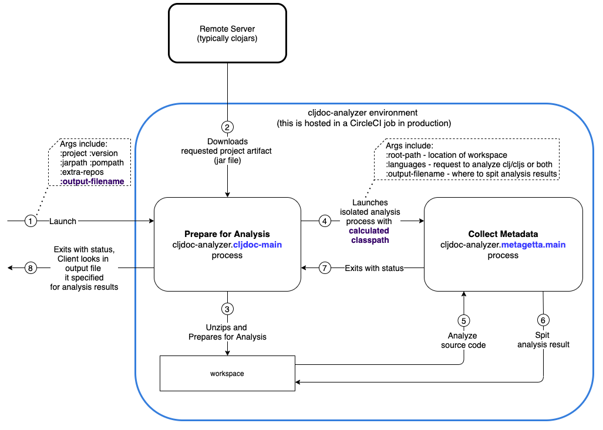

= cljdoc-analyzer
:library-version: v1.0.731
:toc:
:toclevels: 4

== Rationale

A library to analyze then return public APIs for Clojure/ClojureScript projects recognizing that publics APIs can be altered programmatically at load time.

Cljdoc-analyzer takes care to:

* Provide an isolated analysis environment to ensure that only project dependencies are included
* Work around common issues with project dependencies that would otherwise prevent a project from being analyzed

The link:#internal-workings[Internal Workings section] provides more details.

Cljdoc-analyzer's first use is for cljdoc but others might find value in this library.

== History

Some Clojure/ClojureScript projects alter their APIs and related metadata at load time through libraries such as
https://github.com/ztellman/potemkin[potemkin import-vars].

https://github.com/weavejester/codox[Codox] was coded to understand these alterations for the Clojure projects it
documents. Historically, cljdoc took advantage of these smarts via a branch on a fork of codox to get the API metadata
it needed to document Clojure/ClojureScript project. This branch also had an unmerged PR that understood
ClojureScript import-vars type metadata manipulation.

Cljdoc-analyzer picks up from the cljdoc codox unmerged PR in the internal metagetta sub-project and adds what was the
cljdoc analysis-runner module under the main src.

See link:doc/design/01-migration-from-analysis-runner.adoc[migration from analysis runner] for more details.

== Tips for library authors

=== AOT Compilation

AOT-compiled namespaces will lose their metadata, which means you'll lose documentation for namespaces. Avoid having
global `:aot` directives in your project; instead, place them in a specialized profile, such as `:uberjar`.

=== Metadata Examples

Cljdoc analyzer will recognize the following special metadata.

==== :no-doc
The `:no-doc` metadata key is a convention invented by codox to indicate that an element should not be included in API documentation.

Examples:

[source,clojure]
----
;; Documented
(defn square
"Squares the supplied number."
[x]
(* x x))

;; Not documented
(defn ^:no-doc hidden-square
"Squares the supplied number."
[x]
(* x x))
----

`:no-doc` can also be used at the namespace level:

For example:

[source,clojure]
----
(ns ^:no-doc hidden-ns)
----

The Clojure core team still uses https://tomfaulhaber.github.io/autodoc[autodoc] to generate their API docs.
Autodoc's `:skip-wiki` metadata is equivalent to `:no-doc`.

The default metadata that https://github.com/benedekfazekas/mranderson[MrAnderson] adds to inlined namespaces is `:mranderson/inlined`.
We see this as equivalent to `:no-doc` and `:skip-wiki`.

==== :added

To denote the library version the var was added in, use the `:added` metadata key:

[source,clojure]
----
(defn square
"Squares the supplied number."
{:added "1.0"}
[x]
(* x x))
----

==== :deprecated

Similar to `:added`, deprecated vars can be denoted with the `:deprecated` metadata key:

[source,clojure]
----
(defn square
"Squares the supplied number."
{:deprecated "2.0"}
[x]
(* x x))
----

== Warning

Cljdoc-analyzer is not a static code analyzer.  It is interested in the result of programmatic load time alterations.
Use the same judgement you would when using any 3rd party library. If you don't trust it, don't cljdoc-analyze it.

== Usage

=== cljdoc use

Cljdoc-analyzer's first customer is cljdoc. This usage does not cater to general usability. Cljdoc started with
conventional command line arguments but then switched to edn because it made more sense for its use case.

Example of analyzing cljfmt v0.6.4:
[source,bash,options="nowrap"]
----
clojure -M -m cljdoc-analyzer.cljdoc-main \
  '{:project "cljfmt/cljfmt"
    :version "0.6.4"
    :jarpath "https://repo.clojars.org/cljfmt/cljfmt/0.6.4/cljfmt-0.6.4.jar"
    :pompath "https://repo.clojars.org/cljfmt/cljfmt/0.6.4/cljfmt-0.6.4.pom"
    :extra-repos {"clojars" {:url "https://repo.clojars.org/"}
                  "central" {:url "https://central.maven.org/maven2/"}}}'
----

The `:extra-repos` options is somewhat contrived as these repos already exist in cljdoc-analyzer's default config, but this does
reflect current cljdoc usage.

This will log to stdout and, if successful, write to a file in a predefined known spot, as indicated in the output logs:
[source,options="nowrap"]
----
2022-02-22 19:20:17,877 INFO  cljdoc-analyzer.runner - results file: /tmp/cljdoc/analysis-out/cljdoc-analysis-edn/cljfmt/cljfmt/0.6.4/cljdoc-analysis.edn
----

=== general use
You can use cljdoc-analyzer ad hoc to get data for a project published to a maven repo. For example:

[source,bash,no-wrap]
----
clojure -M -m cljdoc-analyzer.main analyze \
  --project io.aviso/pretty --version "0.1.29" \
  --output-filename "io-aviso-pretty-0.1.29.edn"
----
On successful completion, you'll find the output in the current directory in `io.aviso-pretty-0.1.29.edn`

When you are working on a local project, publish it to your local maven repo first, then run the cljdoc analyze command.

If you want to suppress items that have been marked to be excluded from documentation, use `--exclude-with`.
To match cljdoc usage, you would exclude namespaces and publics tagged with `:no-doc` and/or `:skip-wiki`, and also use the `--extra-repo` option:

[source,bash,no-wrap]
----
clojure -M -m cljdoc-analyzer.main analyze \
  --project io.aviso/pretty --version "0.1.29" \
  --output-filename "io-aviso-pretty-0.1.29.edn" \
  --exclude-with :no-doc \
  --exclude-with :skip-wiki \
  --exclude-with :mranderson/inlined \
  --extra-repo "clojars https://repo.clojars.org/" \
  --extra-repo "central https://central.maven.org/maven2/"
----

We can look at other features as we get a feel for what folks are interested in.

=== use as a Clojure CLI tool

You can also install and use cljdoc-analyzer as a https://clojure.org/reference/deps_and_cli#tool_install[Clojure CLI Tool]. First you need to install it:

Specify `{library-version}` or `RELEASE` for the current release.

[source,bash,no-wrap]
----
clojure -Ttools install io.github.cljdoc/cljdoc-analyzer '{:git/tag "RELEASE"}' :as cljdoc
----

and then you can invoke it in one of the supported ways.

.Analyze a library from a (local) Maven repo
[source,bash,no-wrap]
----
clojure -Tcljdoc analyze \
  :project '"io.aviso/pretty"' :version '"0.1.29"' \
  # Alt.1.: Download the jar, pom from a maven repo and derive the paths: \
  :download true \
  # Alt.2.: Provide paths to the project artifacts manually: \
  #:jarpath "/path/to/project.jar" \
  #:pompath "/path/to/project.pom" \
  :extra-repo '["clojars https://repo.clojars.org/"]'
----

See `cljdoc-analyzer.main/analyze` for accepted configuration.

.Analyze a deps-based library in the current directory
[source,bash,no-wrap]
----
cd git clone git@github.com:fulcrologic/fulcro.git
cd fulcro
clojure -Tcljdoc analyze-local
# provided ./pom.xml and ./target/*.jar exist
----

=== logging

If using cljdoc-analyzer as a library, provide your own logging config as appropriate for your app.
A sample `logback.xml` config that logs to stdout can be found under `resources`.

== Output format

The output is a map of namespaces and their publics.

=== edn encoding

The edn has a twist. Function arglists can sometimes contain regular expressions
as desconstructed default values. Since edn does not support deserializing
serialized regular expressions, we adapt by serializing regexes as `#regex`
followed by the string version of regex. For example:
----
#".*booya.*"
----
is serialized as:
----
#regex ".*booya.*"
----
See `cljdoc-analyzer.analysis-edn/serialize` and `cljdoc-analyzer.analysis-edn/deserialize`.

=== map

The edn output is a map of:

* `:group-id` project group-id
* `:artifact-id` project artifact-id
* `:version` project version
* `:analysis` analysis for languages which can consist of a map with none, one or both of:
** `"clj"` list of namespaces (see below)
** `"cljs"` list of namespaces (see below)
* `:pom-str` slurp of maven pom file

list of namespaces is a list of maps of:

** `:name` namespace name
** `:doc` namespace doc string
** `:author` namespace author
** `:publics` namespace publics which is a list of maps of:
*** `:name` public element name
*** `:type` one of: `:macro` `:multimethod` `:protocol` `:var`
*** `:doc`  doc string
*** `:file` file relative to jar root
*** `:line` line number
*** `:arglists` list of vectors of arglists, omitted for `def` `record` and `protocol` elements
*** `:members`  only applicable when `:type` is `:protocol`, list of maps of:
**** `:arglists`  list of vectors of arglists
**** `:name` name of protocol method
**** `:type` can this be only `:var`?

special metadata tags when present are included in publics:

* `:dynamic` for dynamic defs

special metadata tags when present are included on namespaces and/or publics:

* `:added` version an element was added
* `:deprecated` version an element was deprecated
* `:no-doc` author requests that this item be excluded from docs
* `:skip-wiki` autodoc's equivalent to `:no-doc`
* `:mranderson/inlined` metadata that mranderson places on inlined namespaces

[#internal-workings]
== Internal Workings

We use `clojure.tools.namespace` and `cljs.analyzer.api` to load source and collect metadata. This requires the loading
of a project's dependencies. To avoid dependency conflicts and confusion, we keep dependencies at a minimum during
metadata collection time by splitting the work into two distinct phases.

. Prepare for analysis - the source for this work can be found under link:src[src]. Here we do everything we can to prepare for
  metadata collection.
. Collect metadata - the source for this work can be found under link:modules/metagetta[metagetta]. A separate metagetta process
  is launched to collect metadata on sources prepared in step 1.

Here's an overview diagram:

To understand how this fits in the bigger cljdoc picture see the https://github.com/cljdoc/cljdoc/blob/master/doc/cljdoc-developer-technical-guide.adoc#system-overview[the system overview in the cljdoc project].

=== Integration with cljdoc

Cljdoc passes the cljdoc-analyzer dependency to https://github.com/cljdoc/builder[the CircleCI cljdoc analysis job].

This dependency is currently a `:git/url` dependency.
To bring a new version of cljdoc-analyzer into production, we update the `analyzer-version` to the git `:sha` we'd like to use.
At the time of this writing, https://github.com/cljdoc/cljdoc/blob/5171e7924579b9144e5729da92a4454e32c03b23/src/cljdoc/analysis/service.clj#L37-L42[this is specified in `cljdoc.analysis.service`].

== Development

=== Babashka tasks

We use babashka tasks as our dev scripting tool.

To see available tasks run:

[source,shell]
----
bb tasks
----

=== Testing

We use of https://github.com/lambdaisland/kaocha[kaocha] for testing.

To run all tests:

[source,shell]
----
bb test
----

To run a subset of tests, run `bb tasks` to see what's available.

=== Pretty edn

We format expected analysis edn to make it easier to open in an editor and grok any subsequent changes to expectations.
If you add new `test-resources/` edn files, make sure you have https://github.com/borkdude/jet[jet] installed and then run:

[source,shell]
----
bb pretty-expected-edn
----

=== Linting

We use of https://github.com/borkdude/clj-kondo[clj-kondo] for linting.

[source,shell]
----
bb lint
----

=== Check for outdated dependencies

We use https://github.com/liquidz/antq[antq] to check for outdated dependencies.

[source,shell]
----
bb outdated
----

=== Releasing
After you have have dotted all your i's and crossed all your t's, you may want to cut a release.

A release is currently known to immediately impact:

* cljdoc
* cljdoc-analyzer when run as a Clojure Tool

A release must be cut from the main branch. It:

. performs some pre-checks
. runs all tests
. updates appropriate files with the new `v1.0.<commit count>` version
. tags the git repo with `RELEASE` and the `v1.0.<commit count>` version
. pushes tags and changes (this will incidentally trigger a test run on CI, but the release is live regardless)

To cut a release, run:
[source,shell]
----
bb release
----

== Licenses

* Metagetta code and documentation is derived from https://github.com/weavejester/codox[Codox]:
+
Copyright © 2018 James Reeves
+
Distributed under the Eclipse Public License either version 1.0 or (at your option) any later version.
* Otherwise `EPL-2.0` see `LICENSE`
